# Hexapod Robot
The hexapod is a six-legged robot that can be controlled to move in any direction. The six legs give it a dynamic and versatile range of motion. Mounted on the robot is a crane that I designed and built myself, which is capable is retrieving anything on the ground and carry it around.

| **Engineer** | **School** | **Area of Interest** | **Grade** |
|:--:|:--:|:--:|:--:|
| Bani G | Gunn High School | Aerospace and Mechanical Engineering | Incoming Junior

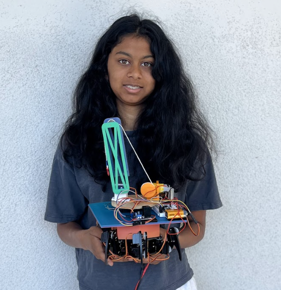

# Modifications

<iframe width="560" height="315" src="https://www.youtube.com/embed/fSlicd6xWKw?si=GanFhlZTktiZWIB_" title="YouTube video player" frameborder="0" allow="accelerometer; autoplay; clipboard-write; encrypted-media; gyroscope; picture-in-picture; web-share" referrerpolicy="strict-origin-when-cross-origin" allowfullscreen></iframe>

For my modificiation, I mounted a crane on my hexapod. The way this works is there is a remote and the actual crane. They are connected via bluetooth. There is a potentiometer, joystick, and two buttons connected to the remote. The potentiometer controls the turntable that rotates the crane. The joystick controls the winch, and it can release and collect string. The buttons control the crane arm, and move it up and down. With these three functions, I can lift a payload. One challenge I had was designing the actual hexapod mount. It was really difficult to get the exact measurements of the angles and distances between the four slits. It took me seven tries to finally have it fit. Another challenge I had was the bluetooth. The servo code library and the bluetooth code library turned out to use the same timer. This caused the servos to twitch a lot. I ended up using a different library and the servos finally worked.

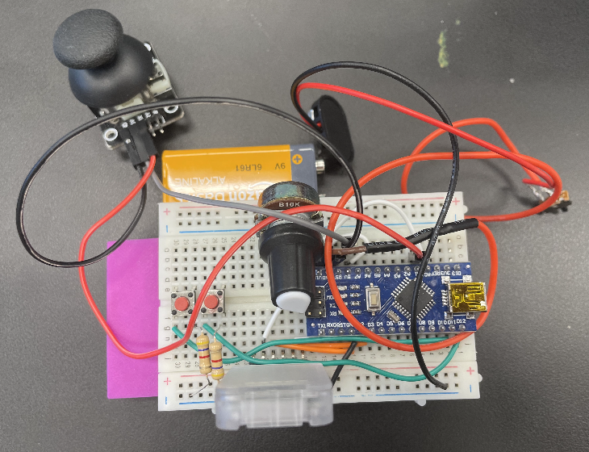

**Figure 1:** *The remote used to control the crane. I designed, wired, and built the whole remote myself.*

# Final Milestone

<iframe width="560" height="315" src="https://www.youtube.com/embed/G1wfri5acvk?si=vUckQLzvb-4nGpFE" title="YouTube video player" frameborder="0" allow="accelerometer; autoplay; clipboard-write; encrypted-media; gyroscope; picture-in-picture; web-share" referrerpolicy="strict-origin-when-cross-origin" allowfullscreen></iframe>

For my final milestone, I built the controller and finished the entire build. The controller works via a bluetooth module that is attached to both the robot and the controller. The Joystick sits on top of a potentiometer, which works by measuring the displacement of the knob from the center, and traslates it into servo motor turns. My next steps will be to add my modifications which include a battery mount as well as a crane. I plan to build a mount on top of the hexapod for the crane, as well as a new remote for the crane. I might combine the hexapod remote and the crane remote into one remote later.


**Figure 2:** *This is the controller for my Hexapod. The joystick sontrols the movement of the hexapod. The switches control how the robot moves, depending on the configuration of on and off. The potentiometers control the height.*

# Second Milestone

<iframe width="560" height="315" src="https://www.youtube.com/embed/opUCqyP4YVc?si=gO0VVhvIhBX_aKKY" title="YouTube video player" frameborder="0" allow="accelerometer; autoplay; clipboard-write; encrypted-media; gyroscope; picture-in-picture; web-share" referrerpolicy="strict-origin-when-cross-origin" allowfullscreen></iframe>

For my second milestone, I finished the robot. For this, I uploaded the code to the arduino and calibrated the legs of the robot. Calibrating the robot was very time consuming as it took a lot of time to precicesly line up the legs where I needed them to be. To calibrate the hexapod, I used the Processing application. After some time, I eventually managed to finish and get the data saved to the arduino. However, I will need to recallibrate if I ever unscrew the legs of the robot and rescrew it back on. As of now, the only thing left to complete is the controller.

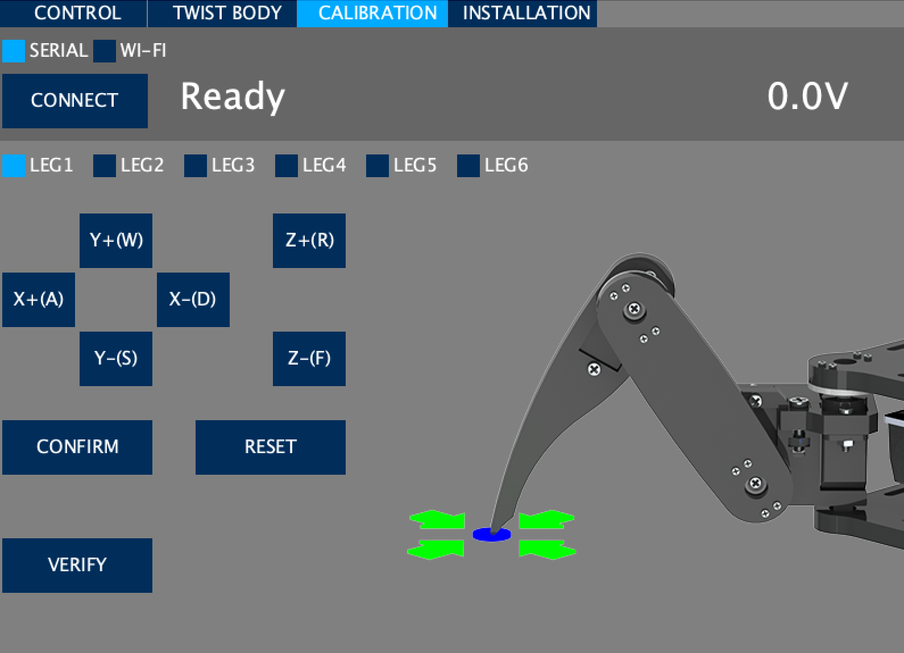
**Figure 3:** *This is the software I used to callibrate the robot.*

# First Milestone

<iframe width="560" height="315" src="https://www.youtube.com/embed/rit9lxJYW2E?si=OV__sKkzZn4NqmJ_" title="YouTube video player" frameborder="0" allow="accelerometer; autoplay; clipboard-write; encrypted-media; gyroscope; picture-in-picture; web-share" referrerpolicy="strict-origin-when-cross-origin" allowfullscreen></iframe>

For my first milestone, I have assembled the body of the hexapod robot. This just means attatching all the body parts to each other and wiring the robot. The only issue I had with my first milestone was the screwing of the screws as they were self tapping screws so they took more time and effort to screw in than normal screws. Also, I soon learned that attention to detail was important; I initially paid no attention to the orientation of certain plates, and later realized that they were meant to be flipped in the other direction. This led to tedious unscrewing and rescrewing of multiple mistakes. Another issue I had was screwing some plates on over the wires. I ended up having to unwire the robot and then screw the plates on, and then rewire under the plates.
My next steps are to build the controller and calibrate the robot. Then I will work on the software. Once this is complete I will be finished with the hexapod and will begin working on my modifications. I plan to make a crane for the robot. I will explore my ideas for modifications more in depth once I finish the hexapod.

# Schematics 

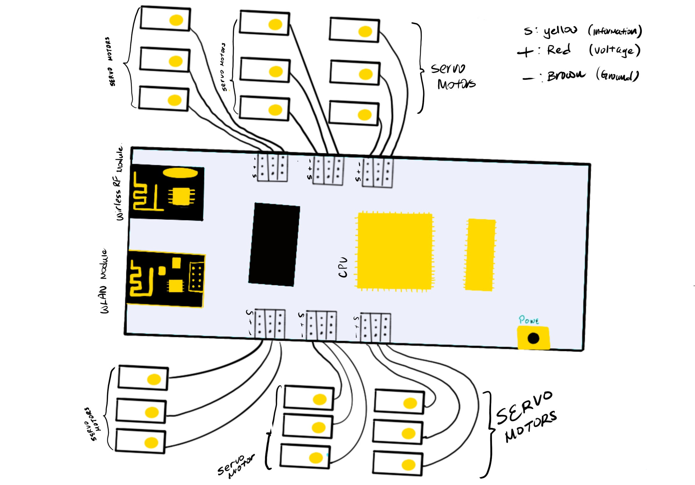
**Figure 4:** *Schematics for the Hexapod robot. Credit to Gary Pan on Procreate.*

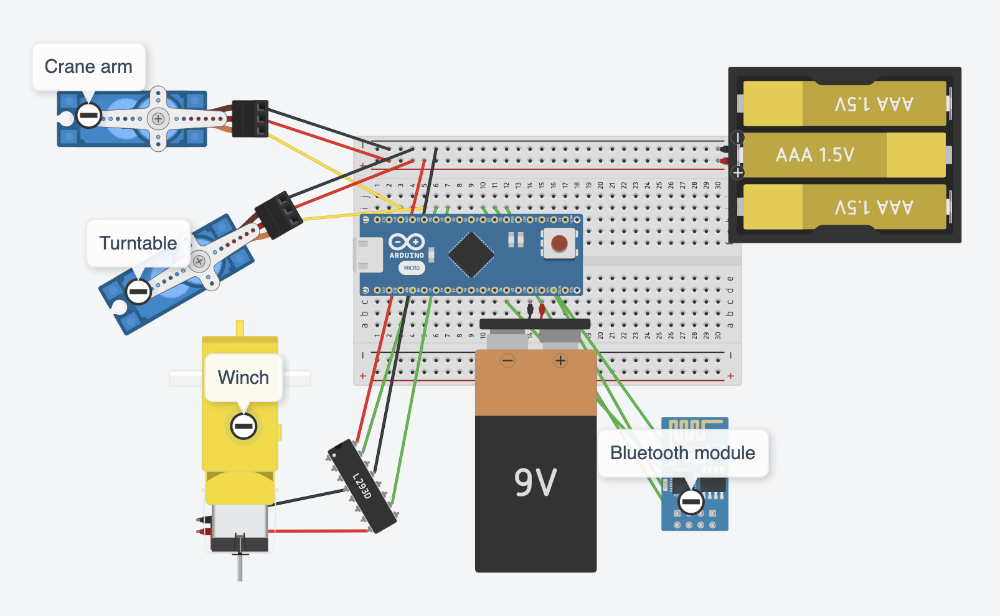
**Figure 5:** *The wiring and schematics of the crane. Designed on Tinkercad.*

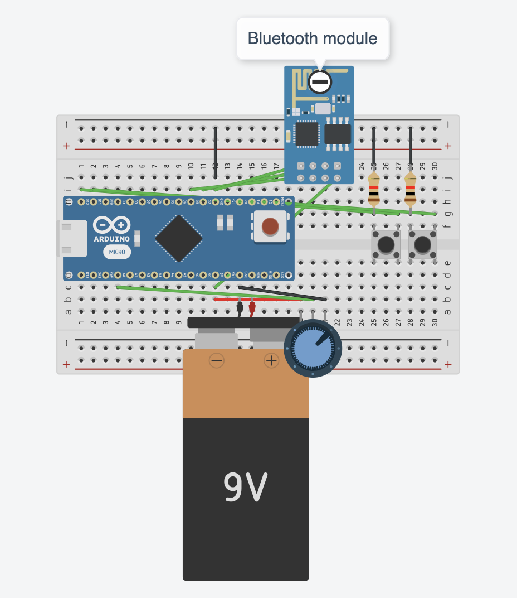
**Figure 6:** *The schematics for the remote of the crane. Joystick is not shown. Designed on Tinkercad.*


**Figure 7:** *A my CAD for the arm of the crane. Designed on OnShape.*

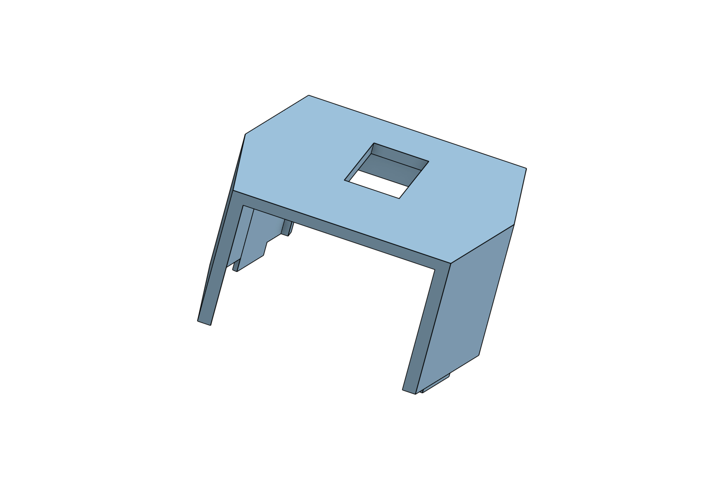
**Figure 8:** *A screenshot of the CAD for the mount of the crane which fits into the Hexapod. Designed on OnShape.*

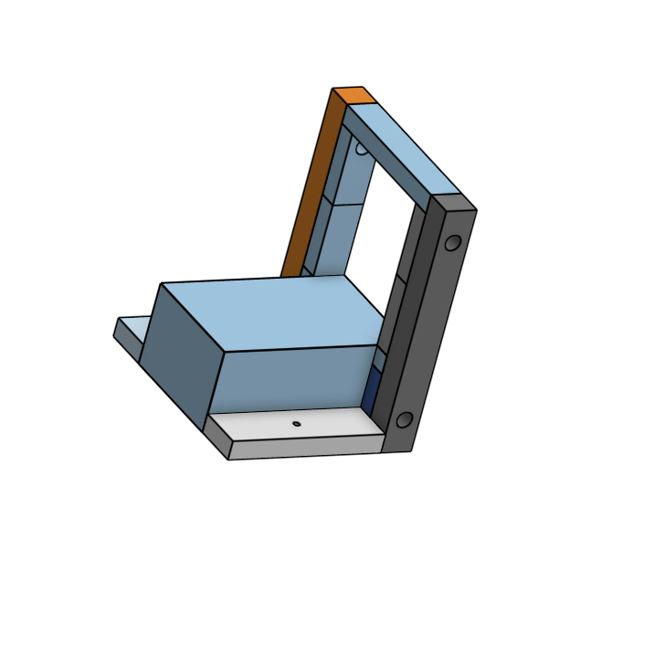
**Figure 9:** *The CAD for the mount I designed to hold the DC motor/winch. Designed on OnShape.*

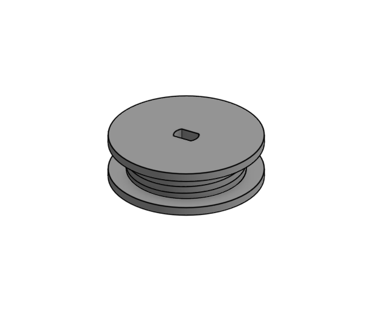

**Figure 10:** *The CAD for the winch. This part attached to the DC motor and can collect and release string. Designed on OnShape.*

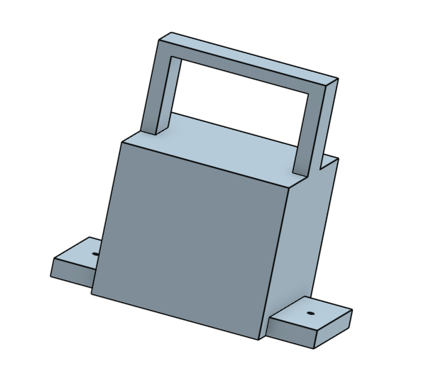

**Figure 11:** *The CAD I designed to mount the servo motor/crane arm to my turntable. Designed on OnShape.*

# Code

## Hexapod Code

```c++
#ifndef ARDUINO_AVR_MEGA2560
#error Wrong board. Please choose "Arduino/Genuino Mega or Mega 2560"
#endif

// Include FNHR (Freenove Hexapod Robot) library
#include <FNHR.h>

FNHR robot;

void setup() {
  // Start Freenove Hexapod Robot with default function
  robot.Start(true);
}

void loop() {
  // Update Freenove Hexapod Robot
  robot.Update();
}
```

## Crane Code

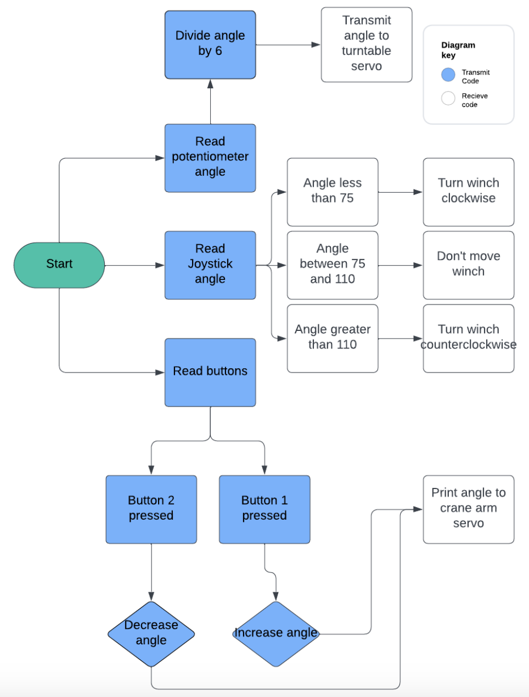
**Figure 12** *Flowchart of crane code. Made on Lucidchart.*

### Transmit Code

```c++
#include <SoftwareSerial.h>


SoftwareSerial bluetooth(3,2);
int button1 = 11;
int button2 = 12;
int potpinServo2 = A0;
int angle2 = 0;


void  setup() {
  pinMode(button1, INPUT_PULLUP);
  pinMode(button2, INPUT_PULLUP);

  bluetooth.begin(9600);

  Serial.begin(9600);

}

void loop() {
 int angle1 = analogRead(potpinServo2) / 6;
 delay(15);

int pressed1 = digitalRead(button1);
int pressed2 = digitalRead(button2);

if(pressed1 == LOW){
  angle2++;
}
if(pressed2 == LOW){
  angle2--;
}
if(angle2 < 0){
  angle2 = 0;
}
if(angle2 > 180){
  angle2 = 180;
}

int angle3 = analogRead(A1) / 6;

bluetooth.write(255);
bluetooth.write(angle1);
bluetooth.write(angle2);
bluetooth.write(angle3);
}
```
### Recieve Code

```c++
#include <NeoSWSerial.h>

#include <Servo.h>

NeoSWSerial bluetooth(3,2);
Servo servo1;
Servo servo2;
int posServo1 = 0;
int valServo2;
#define enB 9
#define in3 6
#define in4 7

void  setup() {
  
  pinMode(8, OUTPUT);
  pinMode(10, OUTPUT);

  pinMode(enB, OUTPUT);
  pinMode(in3, OUTPUT);
  pinMode(in4, OUTPUT);
  
  servo1.attach(10);
  servo2.attach(8);

  servo1.write(0);
  servo2.write(0);
  bluetooth.begin(9600);

  Serial.begin(9600);
}

void loop() {

  if (bluetooth.available() >= 4){
    int flag = bluetooth.read();
    if(flag == 255){
      int angle1 = bluetooth.read();
      int angle2 = bluetooth.read();
      int angle3 = bluetooth.read();
      
      servo2.write(angle1);
      servo1.write(angle2);
      

      if(angle3 < 75){
        digitalWrite(in3, HIGH);
        digitalWrite(in4, LOW);
      }
      
      else if(angle3 > 110 || angle3 == 76 || angle3 == 75){
        digitalWrite(in3, LOW);
        digitalWrite(in4, HIGH);
      }
      
      else if(74 <= angle3 && 110 >= angle3){
        digitalWrite(in3, LOW);
        digitalWrite(in4, LOW);
      }
    }
  }
}
```


# Bill of Materials

| **Part** | **Note** | **Price** | **Link** |
|:--:|:--:|:--:|:--:|
| Hexapod Robot Kit | The kit to build the base hexapod robot | $126.65 |<a href="https://www.amazon.com/Freenove-Raspberry-Crawling-Detailed-Tutorial/dp/B07FLVZ2DN?ref_=ast_sto_dp&th=1"> Link </a>|
| Servo motor | This is used to turn the turntable and change the direction of the crane | $16.99 | <a href="https://www.amazon.com/Control-Angle180-Digital-Torque-Helicopter/dp/B07NQJ1VZ2/"> Link </a>|
| Mini Servo | This is to move the crane up and down | $5.69 | <a href="https://www.amazon.com/Compatible-Helicopter-Airplane-Control-Accessories/dp/B0D1BY4SD6/"> Link </a> |
| DC motor | I used a DC motor as the winch, to bring the hook up and down | $9.98 | <a href="https://www.amazon.com/Stemedu-Gearbox-Motor-Shaft-200RPM/dp/B08M67Q3TB/"> Link </a> |
| Bearings | I used these to allow the string to move freely over the top of the crane arm | $6.59 | <a href="https://www.amazon.com/uxcell-V-Groove-Bearings-3mmx10mmx3mm-Miniature/dp/B082PQ6XNY/"> Link </a> |
| Arduino Nano (2) | One nano was used for the remote and one for the crane | $9.99 | <a href="https://www.amazon.com/ATmega328P-Microcontroller-Board-Cable-Arduino/dp/B00NLAMS9C/"> Link </a> |
| Bluetooth Module (2) | I used the bluetooth to connect the remote and the crane| $10.99 | <a href="https://www.amazon.com/DSD-TECH-Bluetooth-iBeacon-Arduino/dp/B06WGZB2N4/"> Link </a> |
| Breadboards (2) | I wired everything to the two breadboards | $8.99 | <a href="https://www.amazon.com/Breadborad-Solderless-Breadboards-Distribution-Connecting/dp/B082VYXDF1/"> Link </a> |
| Jumper Cables | I used these to wire everything | $6.98 | <a href="https://www.amazon.com/Elegoo-EL-CP-004-Multicolored-Breadboard-arduino/dp/B01EV70C78/"> Link </a> |

<!--
| Item Name | What the item is used for | $Price | <a href="https://www.amazon.com/Arduino-A000066-ARDUINO-UNO-R3/dp/B008GRTSV6/"> Link </a> |
-->

# Starter Project

<iframe width="560" height="315" src="https://www.youtube.com/embed/oBlrQPlmvdY?si=uAyb_n-3glpYcsWq" title="YouTube video player" frameborder="0" allow="accelerometer; autoplay; clipboard-write; encrypted-media; gyroscope; picture-in-picture; web-share" referrerpolicy="strict-origin-when-cross-origin" allowfullscreen></iframe>

For my starter project, I made the Weevil Eyes project. This is a small bug-like object whos eyes glow when it is dark. There is a light sensor which, when it doesn't detect any light, sends a signal to thie leds to light up. This project was very solder heavy and I got a lot of practice painstakingly soldering connections. I had trouble soldering the battery holder on, and therefore I had a lot of issues with the project before I finally managed to solder it properly and get it to work.

# Resources

<a href="https://projecthub.arduino.cc/bruno_opaiva/controling-servo-motors-with-buttons-and-arduino-bcb3b6"> Controlling Servo Motors with Buttons and Arduino </a>

<a href="https://www.instructables.com/Arduino-Two-Way-Communication-Via-Bluetooth-HC-05/"> Arduino Two Way Communication via Bluetooth (HC-05) </a>

<a href="https://howtomechatronics.com/tutorials/arduino/arduino-dc-motor-control-tutorial-l298n-pwm-h-bridge/"> DC Motor with Joystick </a>

<a href="https://newbiely.com/tutorials/arduino-nano/arduino-nano-potentiometer-servo-motor"> Servo Motor with Potentiometer </a>
